# Goodminton Shop API

E-commerce backend for a badminton equipment store. Spring Boot 3 · PostgreSQL · Redis · RabbitMQ · RAG chatbot.

---

## Tech Stack

| Layer              | Choice                                                                                |
| ------------------ | ------------------------------------------------------------------------------------- |
| Runtime            | Java 21, Spring Boot 3.5                                                              |
| Persistence        | PostgreSQL 15, Flyway, Spring Data JPA (Hibernate 6)                                  |
| Cache & session    | Redis (Spring Cache, JWT blacklist, chatbot memory)                                   |
| Auth               | JWT (Nimbus JOSE), Spring Security, OAuth2 Resource Server                            |
| Messaging          | RabbitMQ (product/order events for RAG sync)                                          |
| Search             | Postgres FTS (`unaccent` + `pg_trgm`), GIN indexes                                    |
| Payment            | PayOS (primary), VNPay (fallback)                                                     |
| Media              | Cloudinary (product images, category thumbnails, review media)                        |
| AI / chatbot       | RAG service (separate Python), Ollama (`bge-m3` embed, `qwen2.5:14b` LLM), pgvector   |
| Ops                | Docker Compose, Cloudflare / Tailscale Funnel, GitHub Actions CI/CD                   |

---

## System Architecture

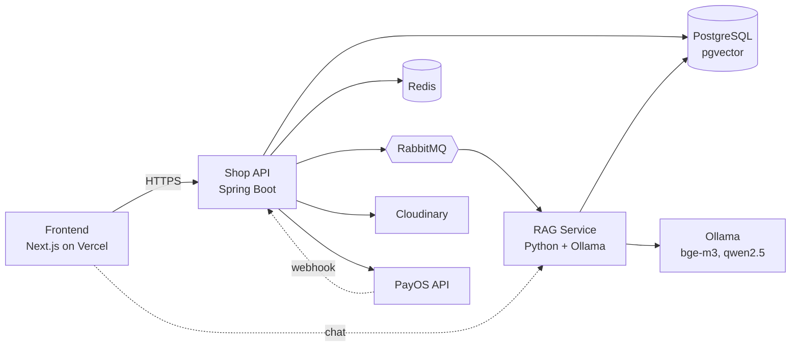

- **Shop API** is the transactional core (products, orders, payment, auth).
- **RAG Service** is a separate service that consumes product/order events, updates `kb_chunks` in Postgres, and serves the chat endpoint.
- **RabbitMQ** decouples the two: shop-api publishes, rag-service consumes, so the main request path is never blocked by embedding work.
- **Ollama** is self-hosted on the VPS GPU. No dependency on OpenAI or paid inference APIs.

---

## Data Model (ERD)

A single ER diagram covering 15+ tables is unreadable, so it is split into three domain-focused sub-diagrams. The `resources` table is polymorphic (`owner_type` + `owner_id`, no FK) and attaches to products, product_variants, categories, and reviews — omitted from the diagrams for clarity.

### Identity and Stores

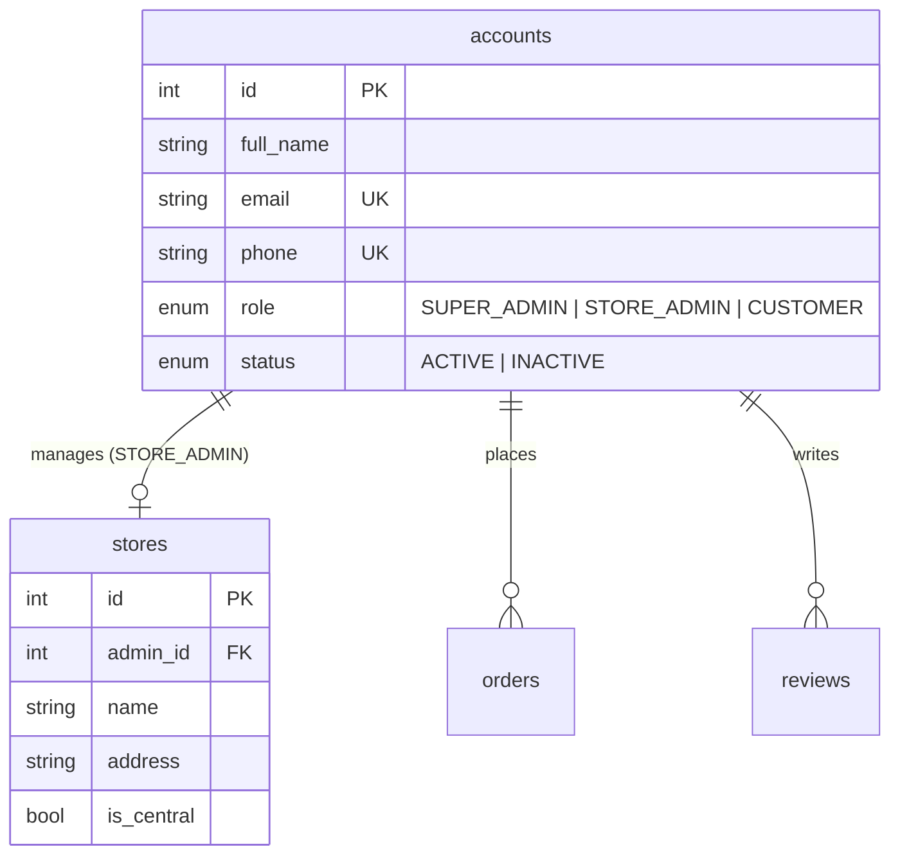

### Catalog

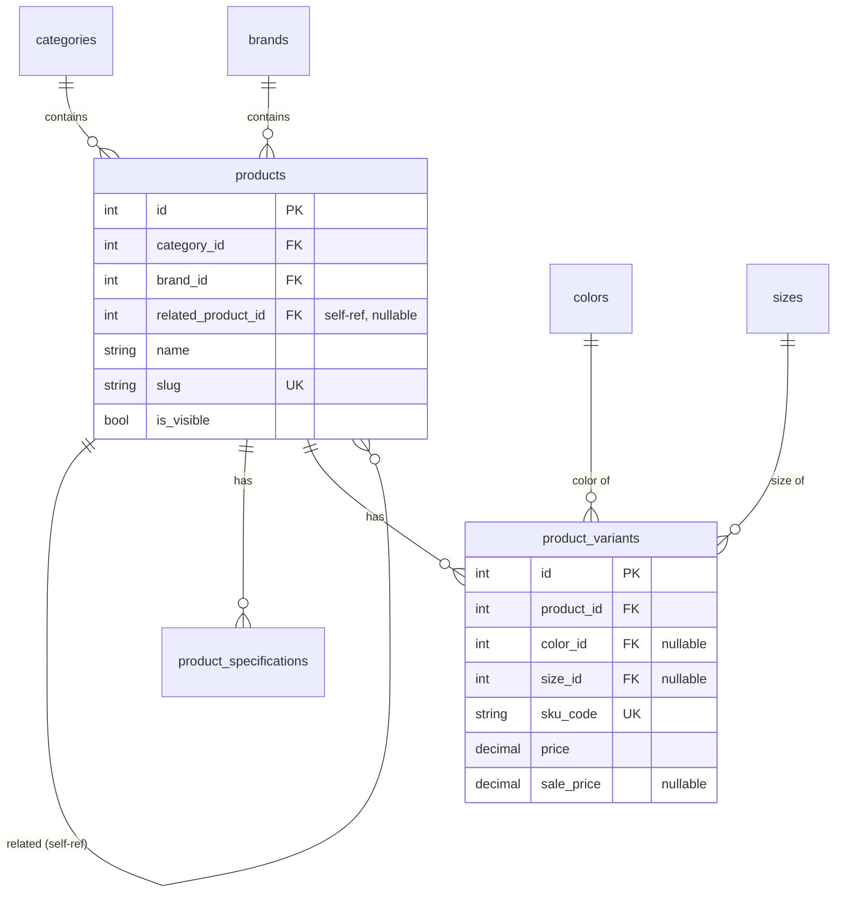

### Commerce (orders, payments, inventory, reviews)

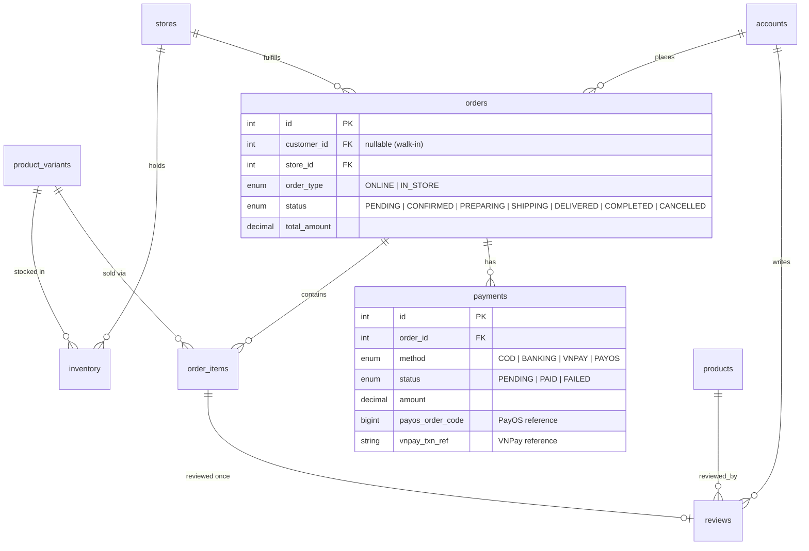

**Notable design choices:**

- `resources` is polymorphic (`owner_type` + `owner_id`, no FK) — one table serves product thumbnails, variant images, category thumbnails, and review media.
- `products.related_product_id` is a self-reference that links color/size siblings back to the root product.
- `orders.customer_id` is **nullable** so walk-in POS orders do not require a user account.
- `product_variants.color_id` and `size_id` are nullable for products with no meaningful color/size (shuttlecocks, bags).

Full schema: [db/migration/V1__init_schema.sql](src/main/resources/db/migration/V1__init_schema.sql)

---

## Core Flows

### 1. Online order and PayOS payment (happy path)

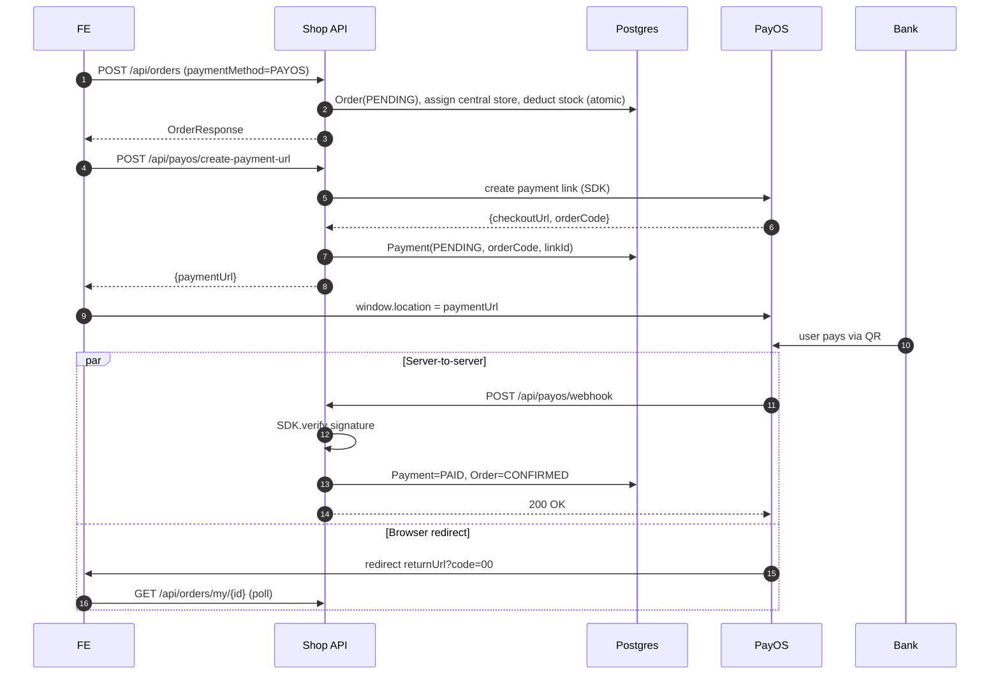

### 2. RAG chatbot query

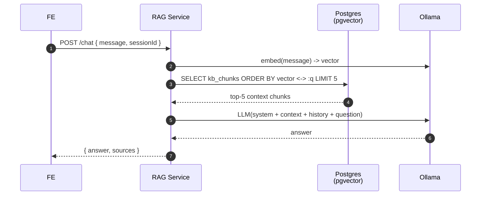

### 3. Product sync (shop-api to rag-service via RabbitMQ)

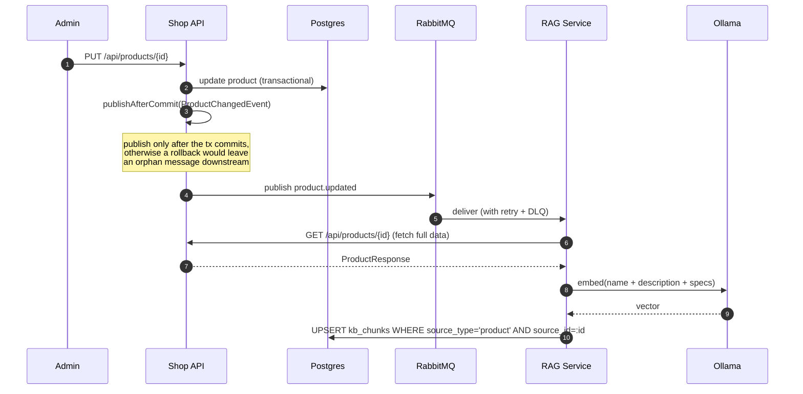

---

## Real cases

### A. Payment race condition (webhook vs browser redirect)

**Problem.** After the user pays, PayOS fires two events in parallel:
1. Server-to-server webhook to the backend, updating the DB.
2. Browser redirect to the frontend result page.

The webhook usually arrives first, but that ordering is not guaranteed.

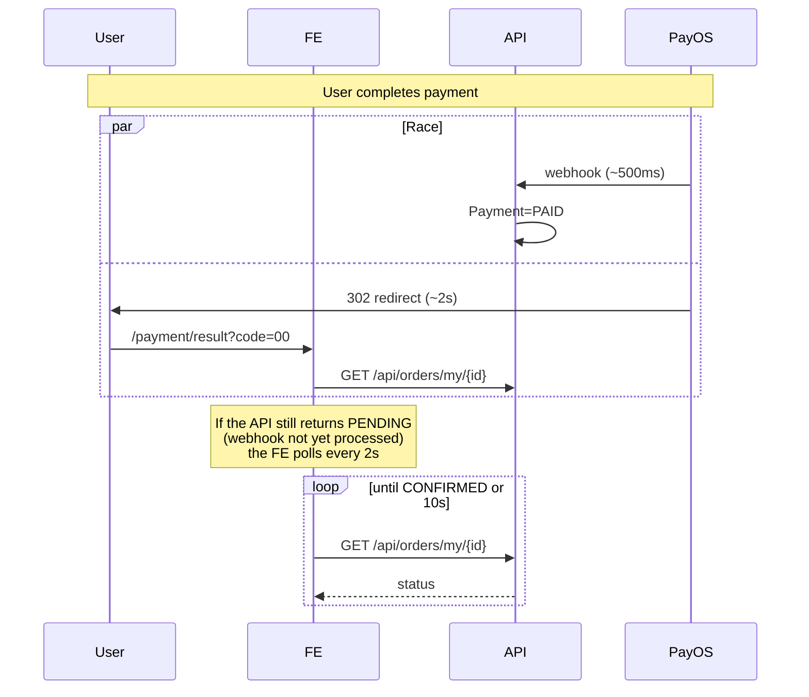

**Solution.** The FE polls `/api/orders/my/{id}` every 2 seconds, up to 10 seconds.

### B. Webhook idempotency (PayOS retry)

**Problem.** PayOS retries the webhook until it receives `200 OK`, so the same payment may be delivered 2 or 3 times.

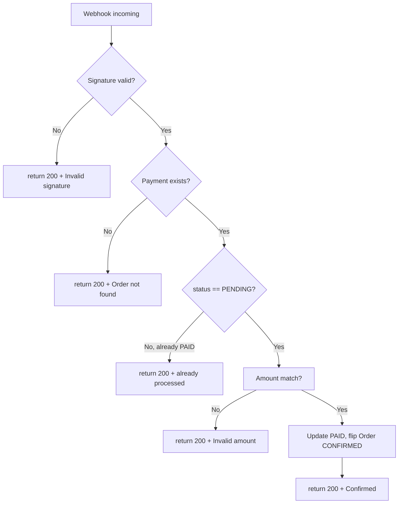

**Key rule.** Always respond with 200 so PayOS stops retrying. Guarding on `status != PENDING` before updating makes the handler idempotent — repeated deliveries hit the "already processed" branch.

Code: [PayOSServiceImpl.processWebhook](src/main/java/com/lezh1n/goodminton_shop_api/services/impl/PayOSServiceImpl.java)

### C. Atomic stock decrement (concurrent purchase race)

**Problem.** Two customers click "Buy" when only one unit is left. Both requests read `quantity = 1`, both think stock is available, both write `quantity = 0` — double sell.

Naive approach (broken):

```java
Inventory inv = repo.findByStoreAndVariant(sid, vid);
if (inv.getQuantity() >= qty) {          // race condition here
    inv.setQuantity(inv.getQuantity() - qty);
    repo.save(inv);
}
```

Correct approach — a single atomic `UPDATE ... WHERE quantity >= :qty` at the DB level:

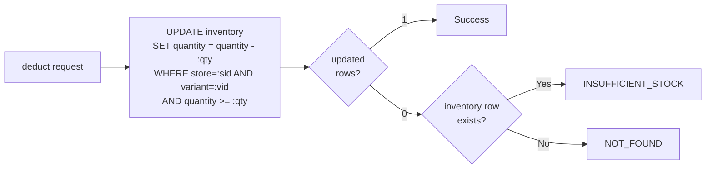

Postgres serialises the `UPDATE ... WHERE` with a row-level lock, so concurrent updates cannot both succeed.

Code: [InventoryRepository.decrementIfAvailable](src/main/java/com/lezh1n/goodminton_shop_api/repositories/InventoryRepository.java)

### D. Order expiration (VNPay / PayOS pending without payment)

**Problem.** The user creates an order, chooses PAYOS, then abandons the checkout. The order stays PENDING forever and the deducted stock is never released.

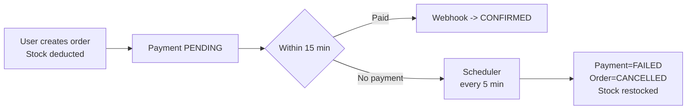

`cancelExpiredProviderPaymentOrders` runs every 5 minutes and covers both VNPay and PayOS. Timeout is configurable per provider via `payment-timeout-minutes`.

Code: [OrderScheduler](src/main/java/com/lezh1n/goodminton_shop_api/services/impl/OrderScheduler.java)

### E. Recommendation cache eviction

Recommendations are `@Cacheable` with a 2h TTL. A few events must invalidate the cache immediately:

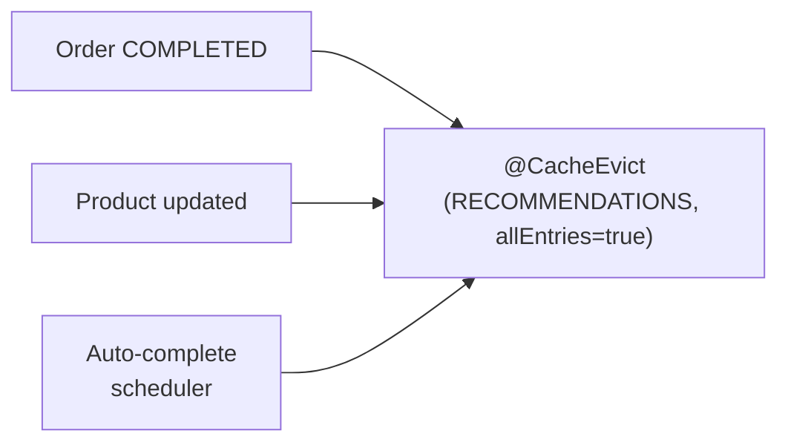

Trade-off: `allEntries=true` flushes the whole cache rather than a per-product entry — with ~1k products, this is simpler than selective eviction and the recompute cost is negligible.

### F. Rate limiter (not implemented, recommended)

Not currently implemented. Recommended for sensitive endpoints:

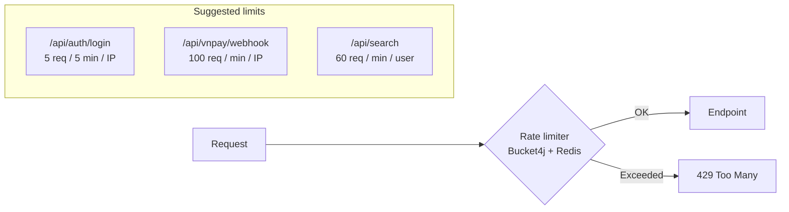

Suggested library: `bucket4j-spring-boot-starter` with Redis-backed distributed state.

### G. Related patterns

| Pattern                                                             | Where                              | Purpose                                                       |
| ------------------------------------------------------------------- | ---------------------------------- | ------------------------------------------------------------- |
| Envelope `ApiResponse<T>`                                           | every endpoint                     | Unified error/success handler on the FE                       |
| `@ControllerAdvice` GlobalExceptionHandler                          | exceptions                         | Maps `AppException` to HTTP status + business code            |
| Ownership check at the service layer                                | inventory, order, review           | STORE_ADMIN can only touch orders/inventory of its own store  |
| Cloudinary cleanup via `TransactionSynchronization.afterCommit`     | resource upload                    | Never delete a cloud file if the transaction rolls back       |
| `@BatchSize(50)` on Order collections                               | orderItems, payments               | Avoids `MultipleBagFetchException` and N+1 loads              |
| Polymorphic resources                                               | resources table                    | One table serves many owner types                             |


---

## Getting started

### Prerequisites
- Docker + Docker Compose
- 8GB RAM minimum (Ollama `qwen2.5:14b` needs roughly 10GB VRAM/RAM)

### Setup

```bash
cp .env.example .env
# Fill in credentials: PAYOS_*, CLOUDINARY_*, POSTGRES_*, JWT_SECRET

docker compose -f docker-compose.dev.yml up -d --build
```

Endpoints:
- API: http://localhost:8080
- Swagger UI: http://localhost:8080/swagger-ui.html
- Health: http://localhost:8080/actuator/health

### Migrations
Flyway runs automatically on startup. Files live in `src/main/resources/db/migration/V*.sql`.

### Documentation
Runtime API docs are available at Swagger UI once the server is up (`/swagger-ui.html`). Additional integration notes are kept out of the public repository.

---

## CI/CD Pipeline

Two GitHub Actions workflows, both defined under `.github/workflows/`.

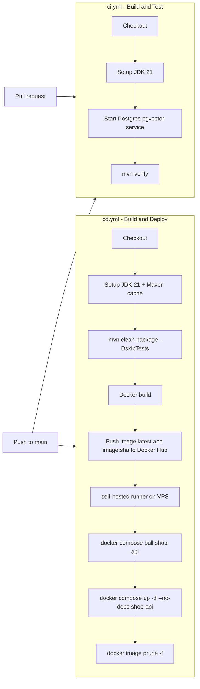

- **CI** (`ci.yml`) runs on every PR and every push to `main`. It boots a `pgvector/pgvector:pg15` service container so integration tests can hit a real Postgres instance.
- **CD** (`cd.yml`) runs only on push to `main`. The `build` job packages the app, builds a Docker image tagged with both `latest` and the commit SHA, and pushes to Docker Hub. The `deploy` job runs on a self-hosted runner living on the production VPS — it pulls the new image and restarts only the `shop-api` service, leaving Postgres, Redis, RabbitMQ, Ollama, and RAG containers untouched.
- **Rollback** — every image is tagged with its commit SHA, so a rollback is `docker compose … pull shop-api@sha256:… && up -d`. In practice, redeploy the previous SHA tag.
- **Secrets** — `DOCKER_USERNAME`, `DOCKER_PASSWORD` configured at the repo level. VPS credentials live on the self-hosted runner, not in GitHub.

---

## License

Private project — for portfolio and educational purposes.
